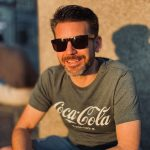

---
# the default layout is 'page'
icon: fas fa-info-circle
order: 4
---

{: style="float: left; margin-right: 1em"}

My name is René van Balen. I’m {{ "now" | date: "%Y" | minus: 1977 }} years old this year and working as a Solution Consultant for Ictivity B.V. located in Eindhoven, in the Netherlands. I’ve been working in the IT sector since 1997 and have seen a lot of different IT environments since.

My specialties are desktop and server virtualization and I have experience with Azure, Active Directory, Failover Clustering, implementation and migration projects, and also Public Key Infrastructure. I’m a VMware Certified Professional on VI3 and vSphere, MCSE on Windows Server 2003 and MCITP Enterprise for Windows Server 2008. I’m also a Citrix Certified Professional on Virtualization and Mobility and a great NetScaler enthousiast.
